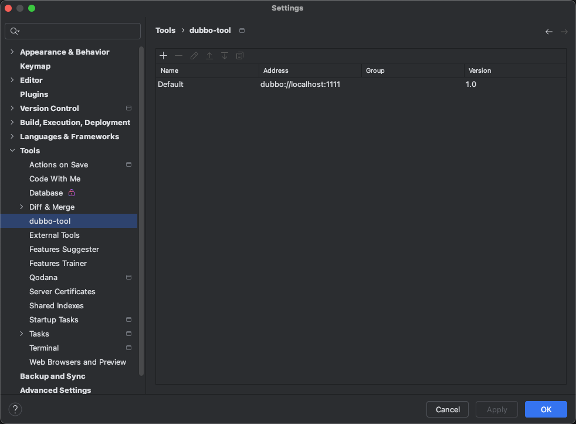
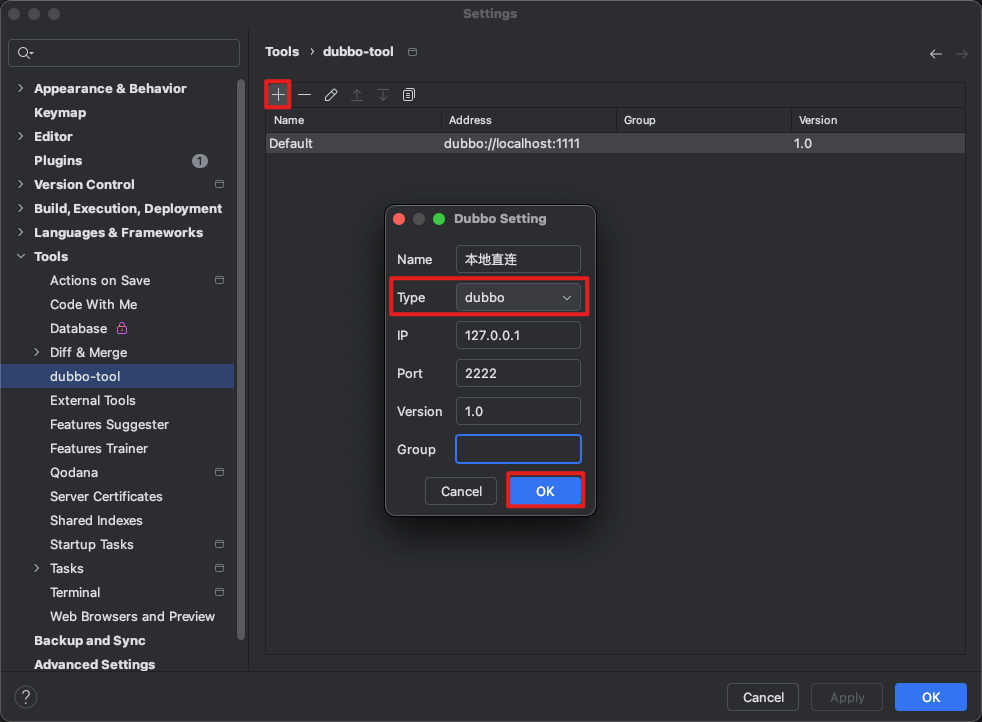
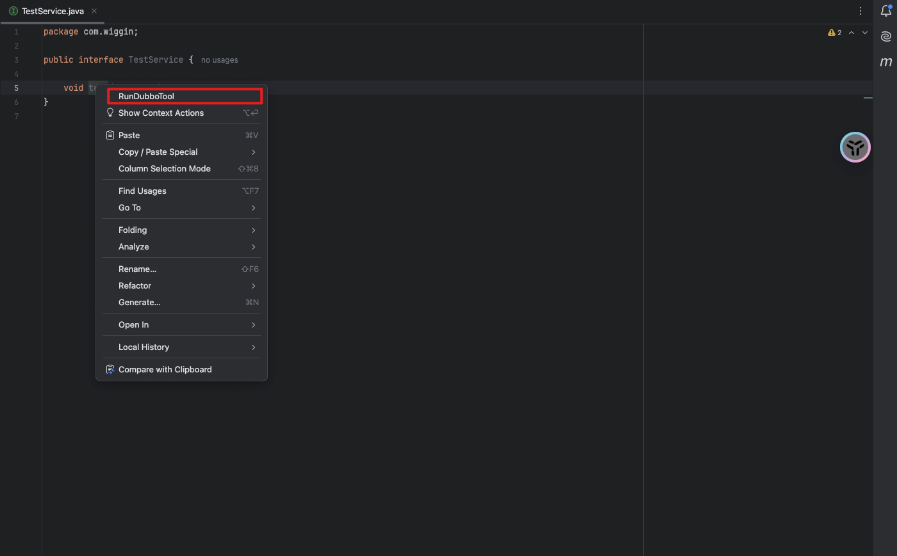
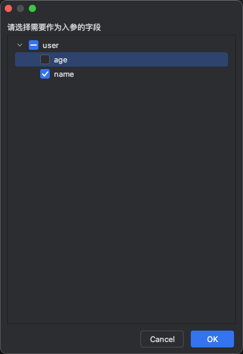
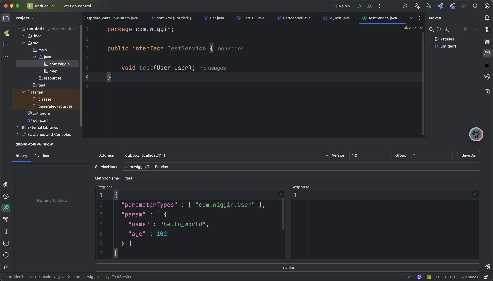
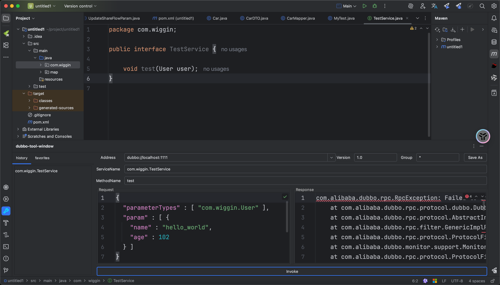
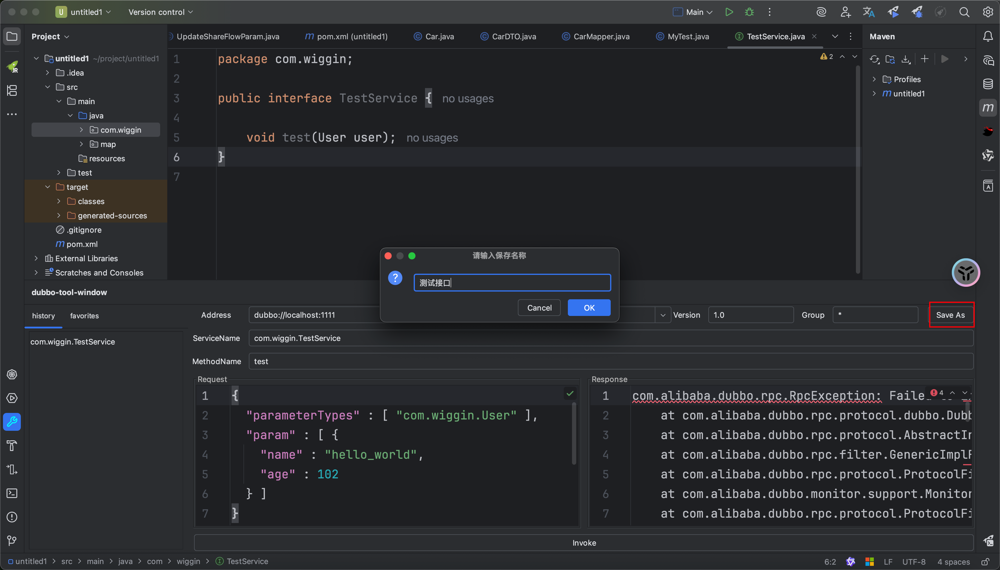
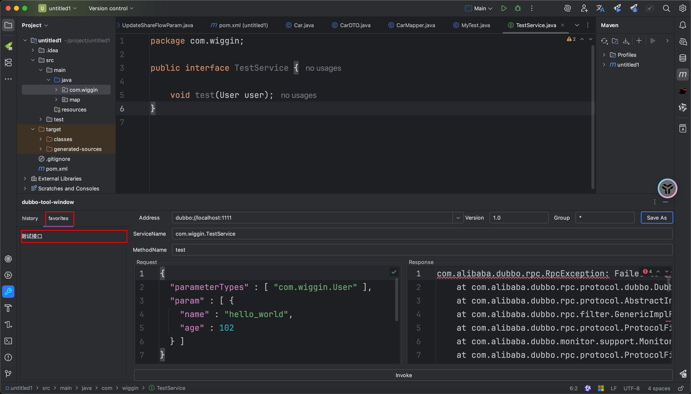

### 一款用于帮助使用 IDEA 编写代码的研发人员，在本地快速发起Dubbo服务调用的插件工具
## ✨ 特性
+ 快速生成Dubbo调用方法和参数
+ 支持Zookeeper注册中心和直连Dubbo调用
+ 集成在IDEA中的便捷操作界面
+ 右键点击接口方法即可触发调用

## 🔨 使用
1、进入idea配置界面，选择Tools --> dubbo-tool，进入dubbo地址配置

点击+，配置dubbo调用的地址（目前支持zookeeper注册中心跟dubbo直接调用）

选择对应的类型（dubbo直连或zk），填写对应的地址、端口，点击ok可以进行保存

2、右键点击待调用的方法名，选择RunDubboTool

3、弹出框中选择要作为入参的参数（如果对象中有很多属性，实际入参就几个，可以勾选想要的入参。默认是全选），点击ok，唤起调用面板

4、在弹出的调用面板中，修改对应的入参

5、点击invoke按钮即可发起调用

最左侧是调用历史和收藏、Response区域是调用的结果

6、对于常用的接口，可以通过save as按钮进行保存，并在左侧切换tab可以查看

7、通过调用历史和收藏记录快速发起调用

点击对应的记录，即可唤起调用面板，填充保存时的调用参数，方便快速发起调用

### 联系作者
使用过程中，如果大家有碰到什么问题，也可通过微信跟我联系

### 说明
1、本插件UI参考另一个dubbo调用插件DubboTest,因其年久失修，且本人觉得原UI的设计挺好的，于是UI在
参考该插件的基础上，融合一些自己日常使用的需求，加入自己的功能
2、本插件目前仅在dubbo2.5版本进行测试，其它版本未经测试
3、本插件仅适合Idea 2024.3 以上版本
